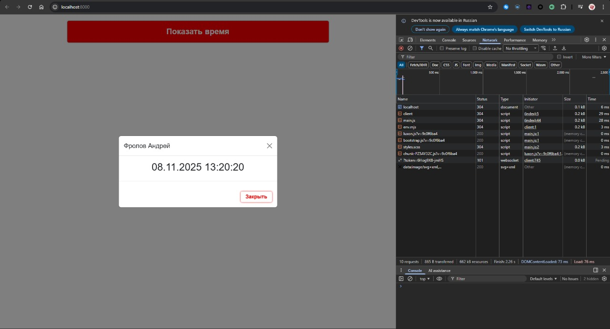

Понял! Вот полностью цельный вариант `REPORT.md`, который можно сразу скопировать и вставить в файл. Все блоки идут подряд, без разделений на куски:

````markdown
# Отчёт по проекту: Минималистичное Bootstrap-приложение с Vite

## 1. Цель проекта
Создать веб-страницу с использованием Bootstrap, полностью собираемую локально через Vite, интегрировать обновление времени с Luxon и минимизировать размер бандла, подключив только необходимые компоненты Bootstrap.

## 2. Используемые технологии
- **Vite** — сборщик проекта  
- **Bootstrap 5** — CSS и JS-компоненты  
- **Luxon** — библиотека для работы с датой и временем  
- **Sass** — препроцессор для стилей  

## 3. Минимальная сборка (grid + modal + button)

### SCSS
Использованы только необходимые модули:

```scss
/* Core */
@import "bootstrap/scss/functions";
@import "bootstrap/scss/variables";
@import "bootstrap/scss/maps";
@import "bootstrap/scss/mixins";

/* Components */
@import "bootstrap/scss/root";
@import "bootstrap/scss/reboot";
@import "bootstrap/scss/grid";
@import "bootstrap/scss/buttons";
@import "bootstrap/scss/close";
@import "bootstrap/scss/modal";
@import "bootstrap/scss/transitions";
@import "bootstrap/scss/utilities";
````

### JS

```js
import { DateTime } from "luxon";
import '../scss/styles.scss';
import 'bootstrap';

function updateTime() {
    const timeElement = document.getElementById("time-display");
    if (timeElement) {
        timeElement.textContent = DateTime.local().setLocale('ru').toFormat('dd.LL.y HH:mm:ss');
    }
}

setInterval(updateTime, 1000);
document.addEventListener('DOMContentLoaded', updateTime);
```

### HTML

Используется контейнер с сеткой, кнопка и модальное окно.
*(Полный код в `src/index.html`.)*

### Команда сборки

```bash
npm run build
```

### Скриншоты и размер бандла

* Скриншот UI страницы:
  
* Размер бандла: CSS — 41.29 KB, JS — 154.34 KB, Общий - 662 KB

## 4. Полная сборка (весь Bootstrap)

### SCSS

```scss
@import "bootstrap/scss/bootstrap";
```

### Скриншоты и размер бандла

* Скриншот UI страницы:
  
* Размер бандла: CSS — 227.45 KB, JS — 154.34 KB, Общий - 896 KB

## 5. Сравнение размеров бандлов

| Версия      | CSS (KB) | JS (KB) | Общий размер(KB) |
| ----------- | -------- | ------- | ---------------- |
| Минимальная | 41.29    | 154.34  | 662              |
| Полная      | 227.45   | 154.34  | 896              |

**Вывод:** Минимальная сборка позволяет существенно сократить размер бандла, сохраняя весь необходимый функционал.

## 6. Ссылки
* Опубликованная версия страницы: [GitHub Pages](https://bluv4nul.github.io)

**Примечание:** Полный код проекта доступен в репозитории (`src/`), включая `index.html`, `main.js`, `styles.scss`, `package.json` и `vite.config.js`.
